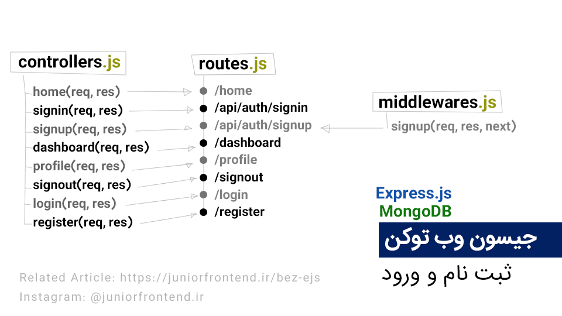
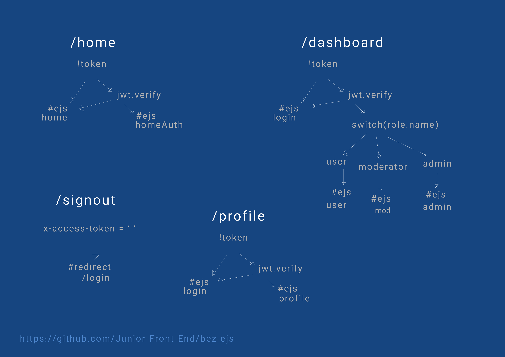

# <p dir="rtl">ثبت نام و ورود با اکسپرس و مونگو (جونیور فرانت اند)</p>

<div dir="rtl">

[مقاله مربوطه](https://juniorfrontend.ir/bez-ejs)

این ریپوسیتوری برای اهداف اموزشی در جونیور فرانت اند تهیه شده است. 





## راه اندازی

### پیشنیاز

باید `mongo community` را نصب کرده باشید.
باید از فیلتر شکن استفاده کنید! 
از ()[این لینک] اقدام کنید! 

### 

</div>

```
yarn install
yarn start
```
<div dir="rtl">

## ویژگی ها

1. سه نقش admin و moderator و user دارد.
2. MongoDB به عنوان دیتابیس انتخاب شده
3. بک اند Express.js است 
4.  فرانت اند با
  ejs طراحی شده که یکی از view engine های اکسپرس است. 
3. از ماژول jwt برای رمز نگاری استفاده شده.
4. امکان ثبت نام وجود دارد.
5. امکان ورود وجود دارد.

## گام های بعدی 

1. رمزنگاری دیتابیس
2. داشبورد اختصاصی برای هر نقش
3. امکان گذاشتن پست و حذف پست و ویرایش آن در داشبورد
4. امکان تغییر رمز عبور در پروفایل یا داشبورد

</div>
